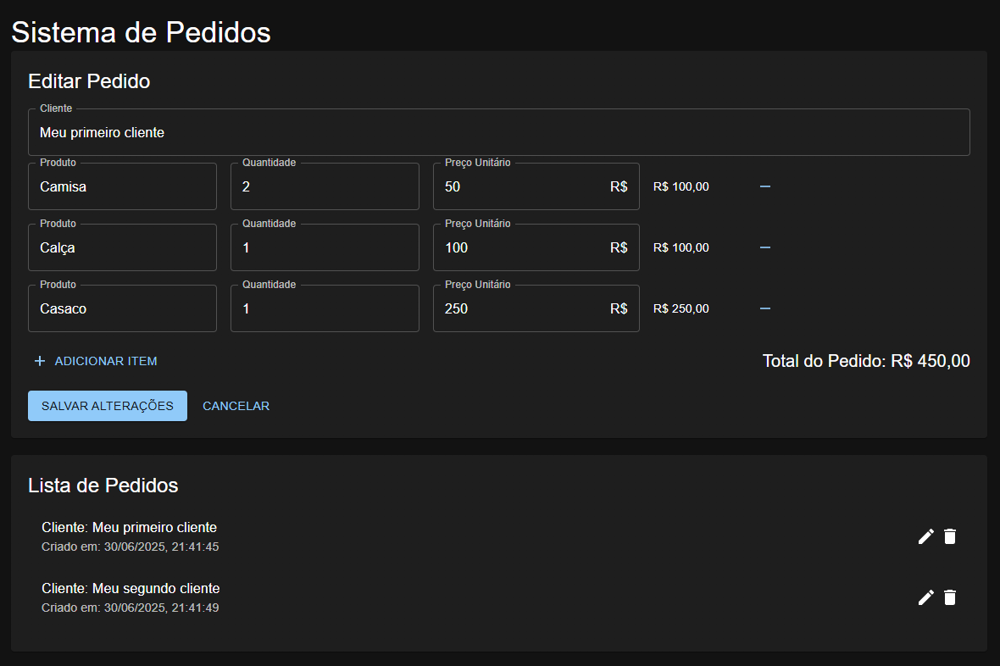
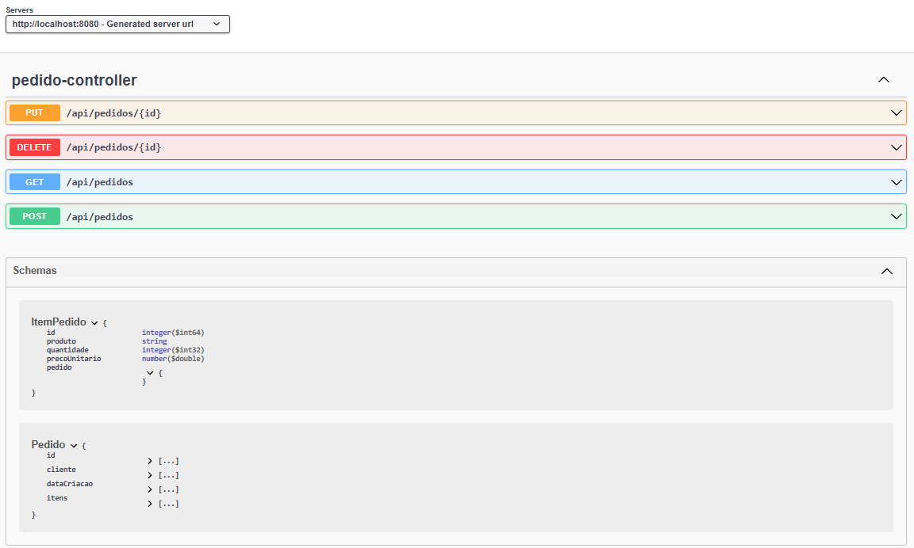

# Sistema de Pedidos - Programação Web

Este projeto é um sistema completo de cadastro e gerenciamento de pedidos, desenvolvido como exercício prático para a disciplina de Programação Web. Ele possui um backend em **Spring Boot** e um frontend em **React** com Material UI, permitindo criar, editar, listar e excluir pedidos e seus itens.

---

<p align="center">
  
</p>

<p align="center">
  
</p>

---

## 🛠️ Tecnologias Utilizadas

- **Backend:** Java 17, Spring Boot, Spring Data JPA, H2 Database, Lombok, Springdoc OpenAPI (Swagger)
- **Frontend:** React 19, Material UI, Axios

---

## 📁 Estrutura do Projeto

```
programacaoWEB/
├── backend/
│   ├── src/main/java/com/programacaoWEB/
│   │   ├── ProgramacaoWebApplication.java
│   │   ├── controller/
│   │   │   └── PedidoController.java
│   │   ├── model/
│   │   │   ├── Pedido.java
│   │   │   └── ItemPedido.java
│   │   └── repository/
│   │       └── PedidoRepository.java
│   └── resources/
│       └── application.properties
├── frontend/
│   └── src/
│       ├── App.js
│       ├── components/
│       │   ├── PedidoForm.jsx
│       │   └── PedidoList.jsx
│       └── services/
│           └── api.js
```

---

## ⚙️ Como Rodar o Projeto

### 1. Clonar o repositório

```bash
git clone https://github.com/seu-usuario/programacaoWEB.git
cd programacaoWEB
```

### 2. Rodar o Backend

```bash
cd backend
mvnw spring-boot:run
```

O backend estará disponível em [http://localhost:8080](http://localhost:8080).

#### Banco de Dados

- O projeto usa **H2 Database** em memória.
- Para acessar o console do H2, vá para [http://localhost:8080/h2-console](http://localhost:8080/h2-console)
  - JDBC URL: `jdbc:h2:mem:testdb`
  - User: `sa`
  - Senha: (deixe em branco)

### 3. Rodar o Frontend

```bash
cd frontend
npm install
npm start
```

O frontend estará disponível em [http://localhost:3000](http://localhost:3000).

---

## 🚀 Funcionalidades

- **Listar pedidos:** Visualize todos os pedidos cadastrados.
- **Criar pedido:** Adicione um novo pedido com múltiplos itens.
- **Editar pedido:** Altere informações do cliente e dos itens de um pedido existente.
- **Excluir pedido:** Remova pedidos do sistema.
- **Tema escuro:** Interface moderna com Material UI em modo dark.
- **Validação e tratamento de erros:** Mensagens amigáveis para erros de exclusão/edição.

---

## 📝 Documentação dos Endpoints (Swagger)

Acesse a documentação interativa dos endpoints REST em:

- [http://localhost:8080/swagger-ui.html](http://localhost:8080/swagger-ui.html)
- ou [http://localhost:8080/swagger-ui/index.html](http://localhost:8080/swagger-ui/index.html)

---

## 📦 Estrutura das Entidades

### Pedido

```json
{
  "id": 1,
  "cliente": "Nome do Cliente",
  "dataCriacao": "2025-06-30T12:00:00",
  "itens": [
    {
      "id": 1,
      "produto": "Produto A",
      "quantidade": 2,
      "precoUnitario": 10.0
    }
  ]
}
```

### ItemPedido

```json
{
  "id": 1,
  "produto": "Produto A",
  "quantidade": 2,
  "precoUnitario": 10.0
}
```

---

## 🖥️ Telas

- **Lista de Pedidos:** Mostra todos os pedidos com opções de editar e excluir.
- **Formulário de Pedido:** Permite criar ou editar pedidos e seus itens.
